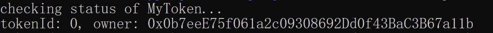

<<<<<<< HEAD
# cross-line-nft
A cross-chain NFT project powered by Chainlink CCIP, enabling secure and seamless NFT transfers across multiple blockchains.
=======
# Sample Hardhat Project

This project demonstrates a basic Hardhat use case. It comes with a sample contract, a test for that contract, and a Hardhat Ignition module that deploys that contract.

Try running some of the following tasks:

```shell
npx hardhat help
npx hardhat test
REPORT_GAS=true npx hardhat test
npx hardhat node
npx hardhat ignition deploy ./ignition/modules/Lock.js
```
>>>>>>> 884c472 (finish local test and function)

hardhat 本地网测试


sepolia and amoy
lock and cross:
npx hardhat check-nft --network sepolia：

npx hardhat check-wnft --network amoy：


burn and cross:
npx hardhat check-nft --network sepolia：

npx hardhat check-wnft --network amoy：
